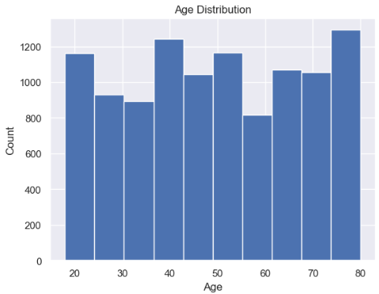
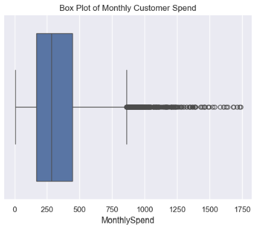
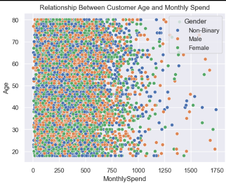
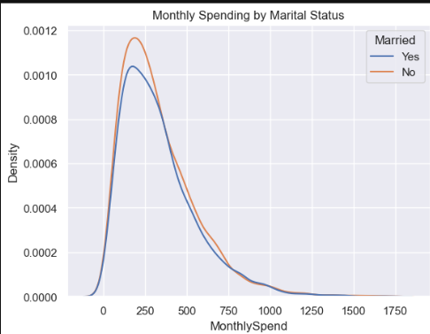

# 📊 Customer Statistics Analysis Using Python

## 📌 Project Overview

This project applies **descriptive statistics and exploratory data analysis (EDA)** to analyze customer data using Python. The analysis focuses on understanding customer demographics, spending patterns, distributions, variability, and relationships between variables.

## 🎯 Objectives

* Analyze customer data using statistical techniques
* Understand data distributions and variability
* Identify potential outliers
* Explore relationships between variables
* Generate meaningful insights through data visualization

## 🛠️ Tools & Technologies

* Python
* Pandas
* NumPy
* Matplotlib
* Seaborn
* Jupyter Notebook

## 📊 Statistical Analysis Performed

* Mean, Median, and Mode
* Variance and Standard Deviation
* Coefficient of Variation
* Percentiles and Quartiles
* Interquartile Range (IQR)
* Outlier Detection
* Skewness Analysis
* Z-Score Analysis
* Correlation Analysis

## 📈 Data Visualizations

The project includes:

* Histograms for analyzing distributions
* Box Plots for identifying outliers
* Bar Charts for categorical analysis
* Scatter Plots for exploring relationships
* KDE Plots for comparing distributions

## 💡 Key Insights

* Explored customer demographic patterns.
* Analyzed the distribution and variability of customer spending.
* Identified potential outliers using statistical techniques.
* Examined relationships between customer characteristics and spending behavior.
* Used visualizations to communicate statistical findings clearly.

## 📂 Project Files

* `Stats_Miniproject.ipynb` – Complete statistical analysis and visualizations
* `US_Customer_Insights_Dataset.csv` – Dataset used for analysis

🚀 Skills Demonstrated
Descriptive Statistics
Exploratory Data Analysis (EDA)
Statistical Interpretation
Data Visualization
Python Programming
Business Insight Generation

## 📸 Project Visualizations

### Age Distribution

### Monthly Customer Spend

### Relationship Between Customer Age and Monthly Spend

### Monthly Spending by Marital Status

⭐ If you found this project interesting, feel free to star the repository!

